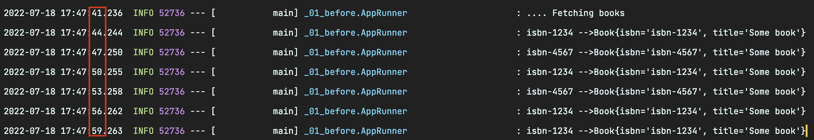
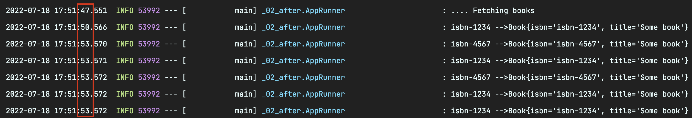

# 스프링 데이터 캐시

Spring이 관리하는 bean에 대해 caching을 활성화 하는 프로세스를 간략하게 안내합니다.


## 실습 코드

### 실습 환경

***build.gradle***

```groovy
plugins {
    id 'org.springframework.boot' version '2.7.1'
    id 'io.spring.dependency-management' version '1.0.11.RELEASE'
    id 'java'
}

group = 'com.example'
version = '0.0.1-SNAPSHOT'
sourceCompatibility = '11'

repositories {
    mavenCentral()
}

dependencies {
    implementation 'org.springframework.boot:spring-boot-starter-cache'
    testImplementation 'org.springframework.boot:spring-boot-starter-test'
}

tasks.named('test') {
    useJUnitPlatform()
}
```

`spring-boot-starter-cache`만 주입해주면 됩니다.


### 변경 전 (_01_before 패키지)

Caching이 적용되기 전 코드를 먼저 살펴봅니다.


***Book.java***

```java
public class Book {

  private String isbn;
  private String title;

  public Book(String isbn, String title) {
    this.isbn = isbn;
    this.title = title;
  }

  public String getIsbn() {
    return isbn;
  }

  public void setIsbn(String isbn) {
    this.isbn = isbn;
  }

  public String getTitle() {
    return title;
  }

  public void setTitle(String title) {
    this.title = title;
  }

  @Override
  public String toString() {
    return "Book{" + "isbn='" + isbn + '\'' + ", title='" + title + '\'' + '}';
  }

}
```

***BookRepository.java***

```java
public interface BookRepository {

  Book getByIsbn(String isbn);

}
```

***SimpleBookRepository.java***

```java
import org.springframework.stereotype.Component;

@Component
public class SimpleBookRepository implements BookRepository {

  @Override
  public Book getByIsbn(String isbn) {
    simulateSlowService();
    return new Book(isbn, "Some book");
  }

  // Don't do this at home
  private void simulateSlowService() {
    try {
      long time = 3000L;
      Thread.sleep(time);
    } catch (InterruptedException e) {
      throw new IllegalStateException(e);
    }
  }

}
```

***AppRunner.java***

```java
@Component
public class AppRunner implements CommandLineRunner {

  private static final Logger logger = LoggerFactory.getLogger(AppRunner.class);

  private final BookRepository bookRepository;

  public AppRunner(BookRepository bookRepository) {
    this.bookRepository = bookRepository;
  }

  @Override
  public void run(String... args) throws Exception {
    logger.info(".... Fetching books");
    logger.info("isbn-1234 -->" + bookRepository.getByIsbn("isbn-1234"));
    logger.info("isbn-4567 -->" + bookRepository.getByIsbn("isbn-4567"));
    logger.info("isbn-1234 -->" + bookRepository.getByIsbn("isbn-1234"));
    logger.info("isbn-4567 -->" + bookRepository.getByIsbn("isbn-4567"));
    logger.info("isbn-1234 -->" + bookRepository.getByIsbn("isbn-1234"));
    logger.info("isbn-1234 -->" + bookRepository.getByIsbn("isbn-1234"));
  }

}
```

1. 간단한 `Book` 도메인 클래스 생성
2. `Book` 조회 요청을 하면 3초 후 반환해주는 `SimpleBookRepository`를 생성
3. 구동 시점에 `Book`을 조회하기 위해 `CommandLineRunner` 설정
   - 실행되면 `isbn-1234`, `isbn-4567` 책을 저장소로부터 반복적으로 가져옵니다.


***결과***



애플리케이션 실행 후 콘솔을 보면 `SimpleBookRepository`가 3초마다 `Book`을 반환하고 있는 것을 볼 수 있습니다.


### 변경 후 (_02_before 패키지)

같은 데이터를 조회해도 3초씩 걸리는 작업을 caching을 통해 개선해보도록 하겠습니다.


***SimpleBookRepository.java***

```java
@Override
@Cacheable("books")
public Book getByIsbn(String isbn) {
  simulateSlowService();
  return new Book(isbn, "Some book");
}
```

먼저 `SimpleBookRepository`에 `@Cacheable("books")` 어노테이션을 추가합니다.


***CachingApplication.java***

```java
@SpringBootApplication
@EnableCaching
public class CachingApplication {
  ...
}
```

그리고 아래와 같이 `@EnableCaching` 어노테이션을 추가하여 caching을 활성화합니다. 이렇게하면 모든 bean의 `public 메소드`에 대한 `caching 어노테이션`의 존재를 감지하는 후 처리기를 동작하도록 합니다. 감지가 되면 `proxy`가 자동으로 생성되어 메소드에 대한 호출을 가로채고 그에 따라 캐싱 동작을 처리합니다.

> **후처리가 감지하는 caching 어노테이션의 종류**
>
> - [`@Cacheable`](https://docs.spring.io/spring/docs/current/javadoc-api/org/springframework/cache/annotation/Cacheable.html)
> - [`@CachePut`](https://docs.spring.io/spring/docs/current/javadoc-api/org/springframework/cache/annotation/CachePut.html) 
> - [`@CacheEvict`](https://docs.spring.io/spring/docs/current/javadoc-api/org/springframework/cache/annotation/CacheEvict.html) 

Spring Boot는 자동으로 적절한 `CacheManager`를 자동으로 관련 캐시에 대한 공급자 역할을 하도록 구성합니다.

현재 문서는 특정 캐싱 라이브러리를 사용하지 않으므로 캐시 저장소는 `ConcurrentHashMap`을 사용하는 간단한 대체제입니다. `caching abstraction`은 광범위한 캐시 라이브러리를 지원하며 [`JSR-107(JCache)`](https://www.jcp.org/en/jsr/detail?id=107)과 완전히 호환됩니다.


***결과***



`isbn-1234`와 `isbn-4567` 두 책에 대한 첫 조회 시에만 3초가 걸리고 그 이후에는 캐시된 데이터를 기반으로 조회하고 있습니다.